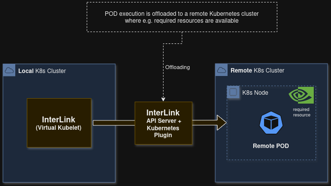

# InterLink Kubernetes Plugin

[InterLink](https://intertwin-eu.github.io/interLink/) plugin to extend the capabilities of *local* Kubernetes
clusters by offloading workloads to *remote* clusters.



## Index

- [InterLink Kubernetes Plugin](#interlink-kubernetes-plugin)
  - [Index](#index)
  - [Prerequisites](#prerequisites)
  - [How to Run](#how-to-run)
    - [Configure](#configure)
    - [Docker Run](#docker-run)
    - [Image Build and Publish](#image-build-and-publish)
    - [Development Run](#development-run)
    - [Socket Mode](#socket-mode)
    - [Install via Ansible role](#install-via-ansible-role)
  - [API Endpoints](#api-endpoints)
  - [Features](#features)
    - [InterLink Mesh Networking](#interlink-mesh-networking)
    - [Pod Volumes](#pod-volumes)
    - [Microservices Offloading (Deprecated)](#microservices-offloading-deprecated)
  - [Troubleshooting](#troubleshooting)
    - [401 Unauthorized](#401-unauthorized)
    - [TLS verify failed](#tls-verify-failed)
  - [Credits](#credits)

## Prerequisites

- Python 3.12 (for local development)
- Docker (for containerized runtime)
- Poetry (for `src/infr/scripts/docker_build_and_publish.sh`)
- Access to a remote Kubernetes cluster (`kubeconfig`)
- Helm CLI only if using the deprecated TCP tunnel feature

## How to Run

### Configure

`src/private/config.sample.ini` defines the plugin configuration.
Create `config.ini` from it and provide your environment values:

```sh
cp src/private/config.sample.ini src/private/config.ini
```

Key properties:

- `k8s.kubeconfig_path`: path to kubeconfig for the *remote* cluster (default: `private/k8s/kubeconfig.yaml`),
  see the [Troubleshooting](#troubleshooting) section for common errors
- `k8s.kubeconfig`: optional inline kubeconfig as JSON
- `k8s.client_configuration`: optional JSON passed to Kubernetes Python client configuration,
  see [configuration object](https://github.com/kubernetes-client/python/blob/master/kubernetes/client/configuration.py)
- `app.socket_address`: plugin listen address, support TCP hosts (`http://0.0.0.0`) and unix sockets
  (default: `unix:///var/run/.plugin.sock`)
- `app.socket_port`: plugin listen port for TCP mode (default: `0`, ignored in unix socket mode)
- `offloading.namespace_prefix`: prefix for offloaded namespaces (default: `offloading`)
- `offloading.namespace_prefix_exclusions`: namespaces excluded from prefixing
- `offloading.node_selector`: optional selector JSON applied to offloaded pods
- `offloading.node_tolerations`: optional tolerations JSON applied to offloaded pods

By default, config is read from `src/private/config.ini`. You can override this with `CONFIG_FILE_PATH`.

### Docker Run

Images are currently published to
[hub.docker.com/r/mginfn/interlink-kubernetes-plugin](https://hub.docker.com/r/mginfn/interlink-kubernetes-plugin).

If your config files are under `./src/private`, run the plugin in socket mode:

```sh
docker run --rm \
  -v ./src/private:/interlink-kubernetes-plugin/private \
  -v ./.devcontainer/sockets:/root/sockets \
  -e APP_SOCKET_ADDRESS=unix:///root/sockets/.plugin.sock \
  docker.io/mginfn/interlink-kubernetes-plugin:latest
```

For TCP mode:

```sh
docker run --rm \
  -v ./src/private:/interlink-kubernetes-plugin/private \
  -e APP_SOCKET_ADDRESS=http://0.0.0.0 \
  -e APP_SOCKET_PORT=4000 \
  -p 30400:4000 \
  docker.io/mginfn/interlink-kubernetes-plugin:latest
```

### Image Build and Publish

Use `src/infr/scripts/docker_build_and_publish.sh` to build and publish the plugin image.

Default behavior:

- reads image version from `pyproject.toml`
- builds `mginfn/interlink-kubernetes-plugin:<version>`
- pushes `<version>` and `latest` tags

Run from repository root:

```sh
src/infr/scripts/docker_build_and_publish.sh
```

Build only (skip push):

```sh
src/infr/scripts/docker_build_and_publish.sh --no-push
```

Set an explicit image tag:

```sh
src/infr/scripts/docker_build_and_publish.sh --tag 1.2.0
```

If `--tag` does not match the version in `pyproject.toml`, the script prompts whether to update
`pyproject.toml` to the provided tag before proceeding.

Create deprecated chart archives (opt-in):

```sh
src/infr/scripts/docker_build_and_publish.sh --create-chart-archives
```

Show all options:

```sh
src/infr/scripts/docker_build_and_publish.sh --help
```

### Development Run

Install dependencies:

```sh
pip install -r src/infr/containers/dev/requirements.txt
```

Start the API server:

```sh
cd src
python -m app.server
```

### Socket Mode

Configure the plugin in `src/private/config.ini`:

```ini
[app]
socket_address=unix:///var/run/.plugin.sock
socket_port=0
```

Then run:

```sh
cd src
python -m app.server
```

InterLink API server must use the same socket path:

```yaml
SidecarURL: "unix:///var/run/.plugin.sock"
SidecarPort: "0"
```

In socket mode, the plugin exposes the same API endpoints (`/status`, `/getLogs`, `/create`, `/delete`) and
forwards them to `KubernetesPluginService` exactly as in TCP mode.

### Install via Ansible role

See [Ansible Role InterLink > In-cluster](https://baltig.infn.it/infn-cloud/ansible-role-interlink#in-cluster)
to install InterLink components together with this Kubernetes Plugin in a running cluster.

## API Endpoints

The v1 controller exposes:

- `GET /status` (also `POST /status` for compatibility)
- `GET /getLogs` (also `POST /getLogs` for compatibility)
- `POST /create`
- `POST /delete`

Interactive docs are available at `/docs` (configurable via `app.api_docs_path`).

## Features

### InterLink Mesh Networking

The plugin supports
[Interlink Mesh Networking](https://github.com/interlink-hq/interLink/blob/474-improve-documentation-for-mesh-networking-feature/docs/docs/guides/13-mesh-network-configuration.mdx)
to allow pods running on the **remote** cluster to communicate with services and pods in the **local** cluster.

Traffic routing is implemented through a mesh-setup sidecar container injected into offloaded pods.
This container is responsible for:

- configure a WireGuard VPN Client that connects to a WireGuard VPN Server running in the local cluster;
- configure routing rules to forward traffic destined for local cluster CIDR through the tunnel;
- encapsulates the VPN tunnel over a websocket connection between the mesh-setup container and a WS Server
  running in the local cluster, so it can traverse NAT and firewalls without additional configuration.

### Pod Volumes

Note: this feature is experimental and may be subject to breaking changes.

The plugin supports offloading pods that reference `spec.volumes` and mount them with
`spec.containers[*].volumeMounts` for:

- `configMap`
- `secret`
- `emptyDir`
- `persistentVolumeClaim`

Behavior summary:

- referenced `ConfigMap` and `Secret` objects are offloaded and scoped to the pod UID
  (i.e., their names are suffixed with POD's uid)
- when the offloaded pod is deleted, scoped `ConfigMap` and `Secret` objects are deleted as well
- PVC offloading is enabled per pod using metadata annotation `interlink.io/remote-pvc`
  (comma-separated list of PVC names that will be offloaded)
- PVC cleanup policy is controlled by PVC annotation `interlink.io/pvc-retention-policy` (`delete` or `retain`)

See example manifest: [test-pod-pvc.yaml](test/manifests/test-pod-pvc.yaml).

Notes:

- that since the POD is submitted to the local cluster, the PVC must exist in the local cluster as well,
  otherwise Kubernetes won't schedule it on the VirtualNode (and the POD won't be offloaded)
  current PVC support is experimental and not yet supported by InterLink API Server.
See [interlink-hq/interLink#396](https://github.com/interlink-hq/interLink/issues/396).

### Microservices Offloading (Deprecated)

Note: this feature is deprecated and may be removed in future releases. It is recommended to use
InterLink Mesh Networking instead.

The plugin supports offloading HTTP microservices through TCP tunnel Helm charts:
[src/infr/charts/tcp-tunnel/README.md](src/infr/charts/tcp-tunnel/README.md).

To enable this feature, configure in `config.ini`:

- `tcp_tunnel.gateway_host`: gateway host IP/DNS
- `tcp_tunnel.gateway_port`: gateway SSH port
- `tcp_tunnel.gateway_ssh_private_key`: SSH private key

For offloaded microservices, explicitly declare container TCP ports in pod specs.
See [test-microservice.yaml](test/manifests/test-microservice.yaml).


The plugin installs a Bastion release in the *remote* cluster for each offloaded pod.
You must install and expose one Gateway instance in the *local* cluster.

## Troubleshooting

### 401 Unauthorized

If the plugin raises `401 Unauthorized`, check the **remote** kubeconfig.

The `cluster` section must include the URL of the Kubernetes API Server and the inline base64-encoded CA certificate:

```yaml
clusters:
- cluster:
    certificate-authority-data: <base64-encoded-CA-certificate>
    server: https://api-kubernetes.example.com
  name: my-cluster
```

Alternatively, provide a CA certificate path and ensure it is readable by the plugin:

```yaml
clusters:
- name: cluster-name
  cluster:
    certificate-authority: /path/to/ca.crt
    server: https://api-kubernetes.example.com
```

You can disable server certificate verification (but you will get "InsecureRequestWarning" in plugin's logs):

```yaml
clusters:
- cluster:
    insecure-skip-tls-verify: true
    server: https://api-kubernetes.example.com
  name: my-cluster
```

In the `users` section, include client certificate/key or token authentication:

```yaml
users:
- name: admin
  user:
    client-certificate-data: <base64-encoded-certificate>
    client-key-data: <base64-encoded-key>
```

Or file paths:

```yaml
users:
- name: admin
  user:
    client-certificate: /path/to/client.crt
    client-key: /path/to/client.key
```

Or token-based authentication:

```yaml
users:
- name: admin
  user:
    token: <auth-token>
```

### TLS verify failed

If the plugin raises
`certificate verify failed: unable to get local issuer certificate` while reaching the remote cluster,
your cluster may use self-signed certificates.

You can disable certificate verification:

- `k8s.client_configuration={"verify_ssl": false}`

Or explicitly provide CA/client certificates:

- `k8s.client_configuration={"verify_ssl": true, "ssl_ca_cert": "private/k8s-microk8s/ca.crt",`
  `"cert_file": "private/k8s-microk8s/client.crt", "key_file": "private/k8s-microk8s/client.key"}`

## Credits

Originally created by Mauro Gattari @ INFN in 2024.
