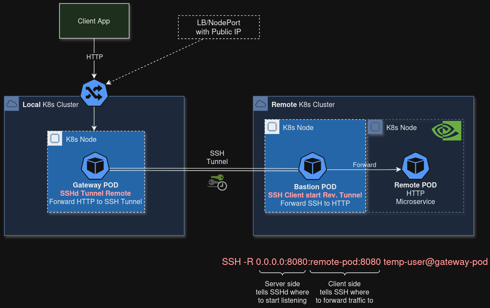

Helm charts to install a TCP Tunnel for secure connections between a pair of Gateway and Bastion hosts.

This folder includes two subcharts to be installed separately:
- `gateway` chart to be installed in the *local* cluster
- `bastion` chart to be installed in the *remote* cluster

Notes:
- a single release of `gateway` chart has to be installed in the *local* cluster and will handle multiple TCP tunnels;
- for each pod deployment in the *remote* cluster, a `bastion` chart release has to be installed in the *remote* cluster to open the TCP tunnel.



# Index

- [Index](#index)
- [SSH key pair](#ssh-key-pair)
- [Install Gateway](#install-gateway)
- [Install Bastion](#install-bastion)
  - [Check tunnel](#check-tunnel)

# SSH key pair

Generate an SSH key pair:
```sh
ssh-keygen -t rsa -b 4096 -C "interlink-gateway-key" -f ./private/ssh/id_rsa
# later when installing the Bastion host, you'll need the Base64 encoding of private key that you can generate as follows:
base64 --wrap 0 ./private/ssh/id_rsa
```

# Install Gateway

Install Gateway in the *local* cluster.

**Example.**

Install release `gateway`:
```sh
helm install gateway interlink-repo/tcp-tunnel/charts/gateway \
    --namespace tcp-tunnel --create-namespace \
    --set ssh.publicKey="$(cat ./private/ssh/id_rsa.pub)" \
    --set ssh.port=2222 \
    --set service.port=30222 \
    --dry-run --debug
```

The command above deploys a Gateway pod that listens for SSH connections on port 2222, moreover a NodePort is created to expose a public port 30222 to reach the SSH daemon.
The Bastion pod will connect to public port 30222 to create a Reverse SSH Tunnel.
See [values.yaml](src/infr/charts/tcp-tunnel/charts/gateway/values.yaml) for all parameters and default values.

For development purposes, you can specify `tunnel.service.*` parameters to additionally deploy a NodePort `sourceNodePort` that forwards traffic to Gateway port `sourcePort`: assuming a reverse tunnel from `sourcePort` has been created, this setup can be used to send external TCP traffic to the tunnel through `<node-public-ip>:sourceNodePort`:
```sh
helm install gateway interlink-repo/tcp-tunnel/charts/gateway \
    --namespace tcp-tunnel --create-namespace \
    --set ssh.publicKey="$(cat ./private/ssh/id_rsa.pub)" \
    --set ssh.port=2222 \
    --set service.port=30222 \
    --set tunnel.service.sourcePort=8181 \
    --set tunnel.service.sourceNodePort=30181 \
    --dry-run --debug
```

> **Note:** option `--dry-run --debug` returns the generated template without submitting it.

# Install Bastion

Install Bastion in the *remote* cluster.

**Example.**

Install release `bastion`:
```sh
# Public IP/port of the SSH daemon running in the Gateway host (*local* cluster):
GATEWAY_HOST=131.154.98.96
GATEWAY_PORT=30222
# The Reverse SSH Tunnel remote port (*local* cluster):
GATEWAY_TUNNEL_PORT=8181
# The Reverse SSH Tunnel local host/port (*remote* cluster): name and port of the service where the Bastion host will forward traffic coming from the tunnel (it can be a service name in Bastion's kubernetes cluster)
SERVICE_HOST=your-service.your-namespace.service.cluster.local
SERVICE_PORT=80
# Install Bastion
helm install bastion-to-your-service interlink-repo/tcp-tunnel/charts/bastion \
    --namespace tcp-tunnel --create-namespace \
    --set tunnel.gateway.host=${GATEWAY_HOST} \
    --set tunnel.gateway.port=${GATEWAY_PORT} \
    --set tunnel.gateway.ssh.privateKey=$(base64 --wrap 0 ./private/ssh/id_rsa ) \
    --set tunnel.service.gatewayPort=${GATEWAY_TUNNEL_PORT} \
    --set tunnel.service.targetHost=${SERVICE_HOST} \
    --set tunnel.service.targetPort=${SERVICE_PORT} \
    --dry-run --debug
```

## Check tunnel

Assuming port ${GATEWAY_PORT} on Gateway host is exposed through a NodePort 30181 (see `tunnel.service.*` parameters in [Install Gateway](#install-gateway)),
you can check whether TCP port 30181 is open on ${GATEWAY_HOST}:
```sh
nc -zv ${GATEWAY_HOST} 30181
```

Then you can check whether HTTP traffic from ${GATEWAY_HOST}:30181 (the *local* cluster) is forwarded to ${SERVICE_HOST}:${SERVICE_PORT} (the *remote* cluster):
```sh
curl --location "http://${GATEWAY_HOST}:30181/your/path"
```
